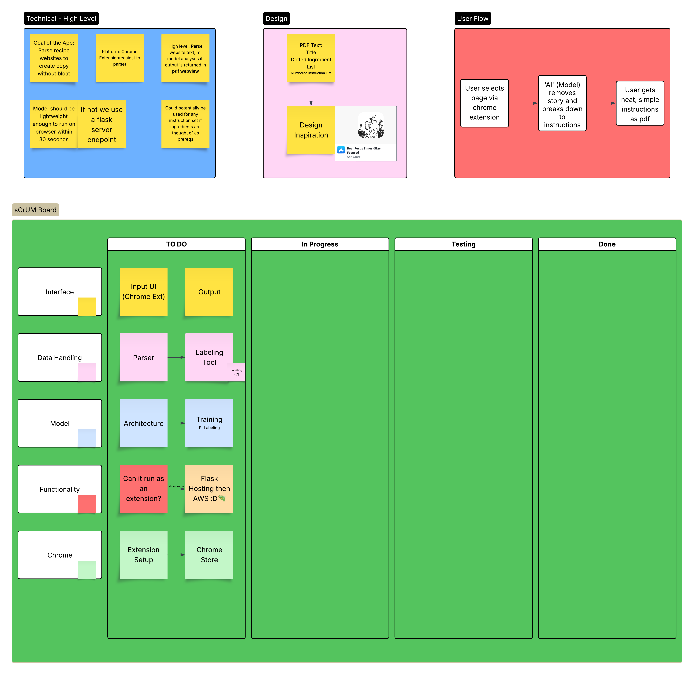

# RecipeCondenser
A lot of recipe websites are filled with adds and stories which make the page hard to navigate. This project is a chrome extension which identifies important instructions and condenses them all into a neat pdf

## Devving
It's bad practice to throw this in the readme but here's a scrum board for the plans. Throw an issue or txt me if you want to expand on one of the subjects or take a task. Lucidchart only gives me 3 people to add to document :(

